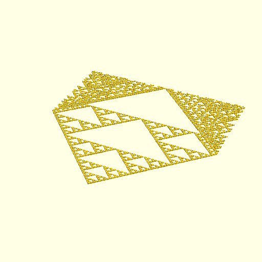

# eca-scad

Elementary Cellular Automata (ECA) in OpenSCAD

Small library to evolve ECAs in OpenSCAD.
Use it to create nice [textures](https://github.com/joh/texture-surface) for your 3D objects :)

To get started, see [eca-demo.scad](eca-demo.scad).
